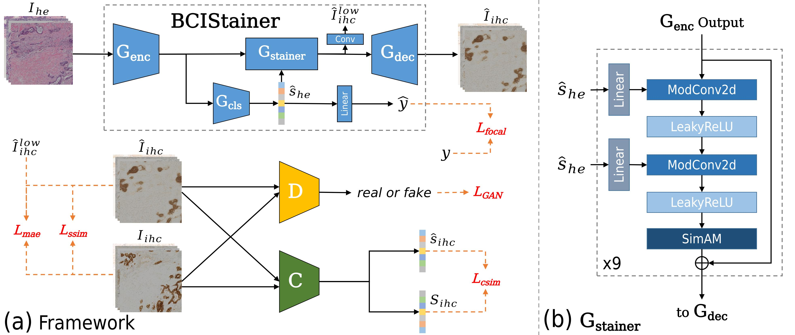
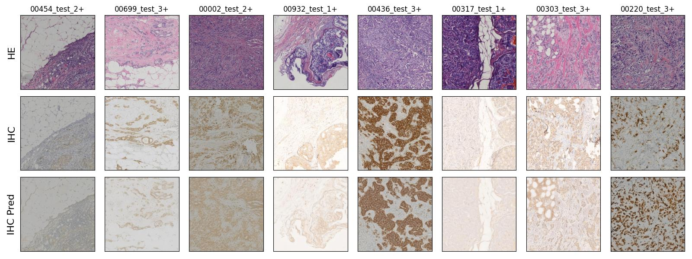
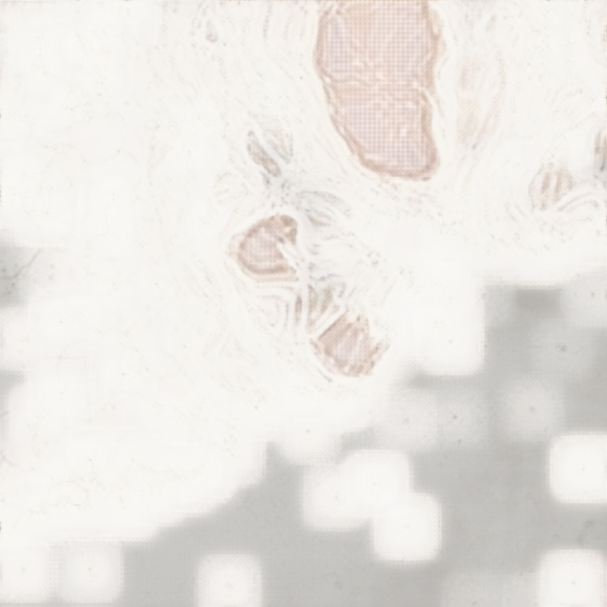
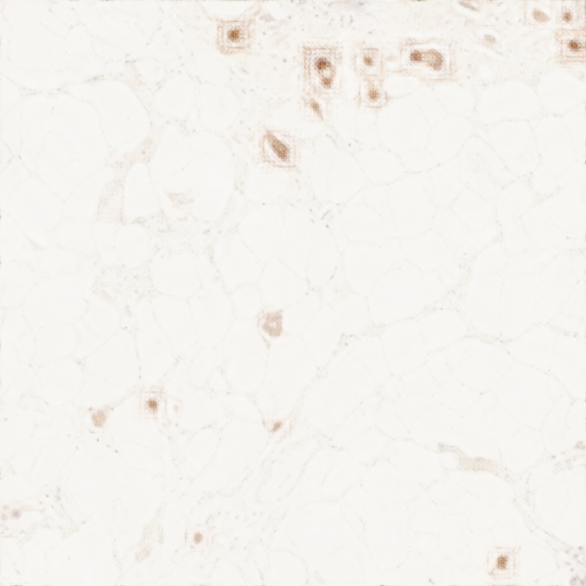
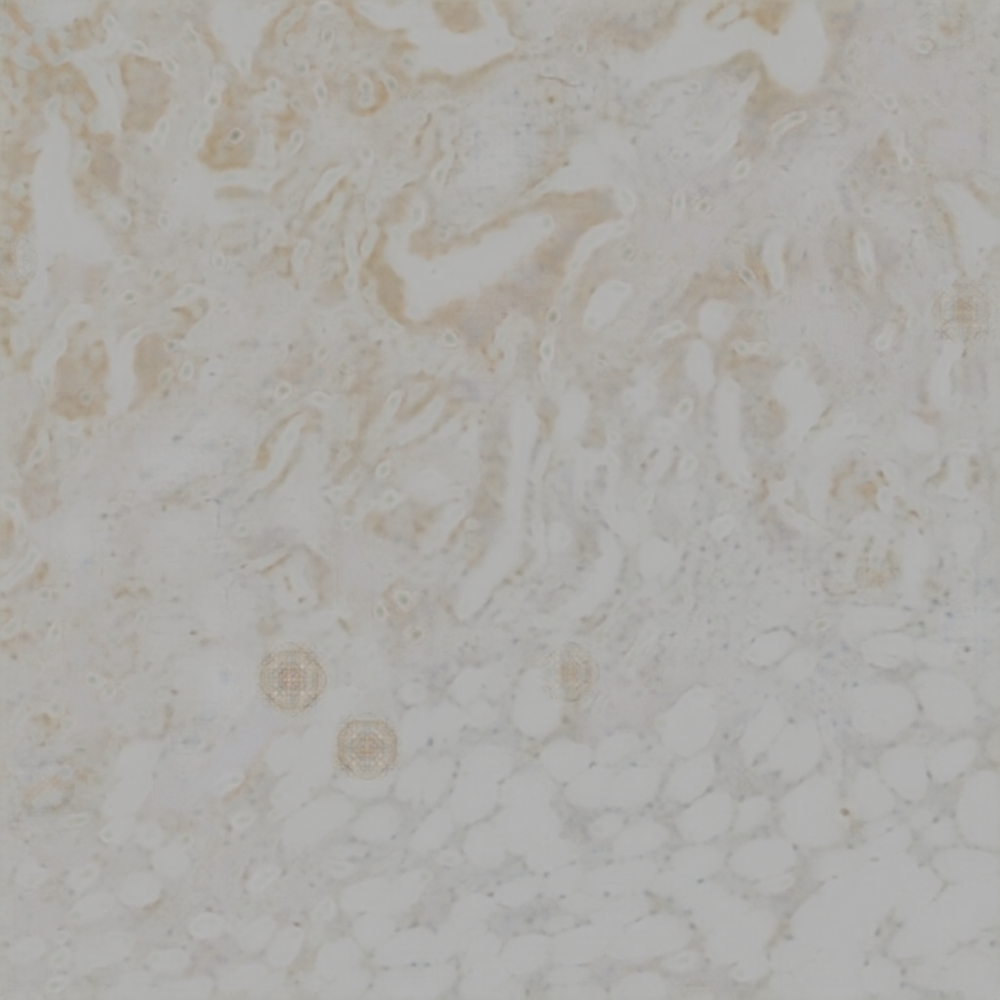
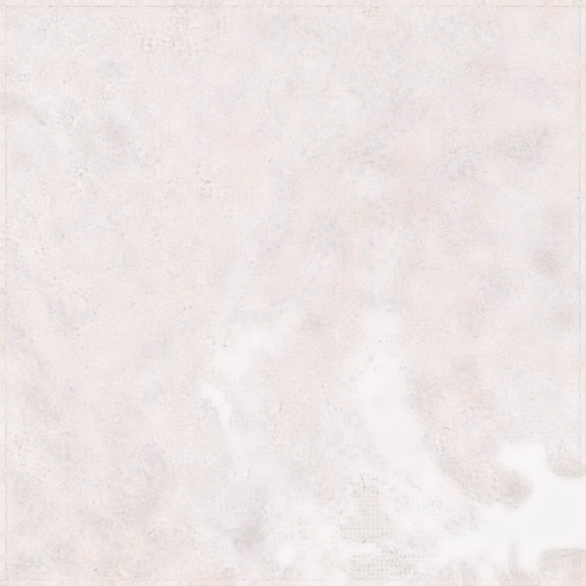

# BCIStainer

A solution for Challenge: [Breast Cancer Immunohistochemical Image Generation Challenge](https://bci.grand-challenge.org/)

BCIStainer tries to translate hematoxylin and eosin (HE) stained slices to immunohistochemical techniques (IHC) stained slices.

## 1. Workflow



## 2. Environment

```bash
# using conda
conda create --name bci python=3.8
conda activate bci

# pytorch 1.12.0
pip install torch==1.12.0+cu113 torchvision==0.13.0+cu113 -f https://download.pytorch.org/whl/torch_stable.html

# other packages
pip install -r requirements.txt
```

## 3. Dataset

Download dataset from [BCI page](https://bupt-ai-cz.github.io/BCI/) and put it in [data](./data) directory as folowing file structure:

```
./data
├── test
│   ├── HE
│   ├── IHC
│   └── README.txt
├── train
│   ├── HE
│   ├── IHC
│   └── README.txt
└── val
    ├── HE
    ├── IHC
    └── README.txt
```

## 4. Training and Evaluation

Train model using [train.sh](./scripts/train.sh):

```bash
# training
CUDA_VISIBLE_DEVICES=0          \
python train.py                 \
    --train_dir   ./data/train  \
    --val_dir     ./data/val    \
    --exp_root    ./experiments \
    --config_file ./configs/stainer_basic_cmp/exp3.yaml \
    --trainer     basic
```

Logs, and models are saved in [experiments/stainer_basic_cmp/exp3](./experiments/stainer_basic_cmp/exp3).

Download pretrained model and put it into above directory:

- Google Drive: TBD
- BaiduYun: https://pan.baidu.com/s/1QxZ2zB0CHZKyttXqpS9iDw  Code: mjmk

Predict stained slices and calculate metrics using [evaluate.sh](./scripts/evaluate.sh):

```bash
# evaluation
CUDA_VISIBLE_DEVICES=0            \
python evaluate.py                \
    --data_dir    ./data/test     \
    --exp_root    ./experiments   \
    --output_root ./evaluations   \
    --config_file ./configs/stainer_basic_cmp/exp3.yaml \
    --model_name  model_best_psnr \
    --apply_tta   true            \
    --evaluator   basic
```

Predictions and metrics for each input can be found in [evaluations/stainer_basic_cmp/exp3](./evaluations/stainer_basic_cmp/exp3).

## 5. Metrics on Test

<table style="text-align:center">
    <thead>
        <tr>
            <th>Submit</th>
            <th>Configs</th>
            <th>Style</th>
            <th>SimAM</th>
            <th>Comparator</th>
            <th>TTA</th>
            <th>PSNR</th>
            <th>SSIM</th>
        </tr>
    </thead>
    <tbody>
        <tr>
            <td rowspan="2"></td>
            <td rowspan="2"><a href="./configs/stainer_basic_cmp/exp1.yaml">stainer_basic_cmp/exp1</a></td>
            <td rowspan="2">mod</td>
            <td rowspan="2">x</td>
            <td rowspan="2">basic</td>
            <td>x</td>
            <td>22.3711</td>
            <td>0.5293</td>
        </tr>
        <tr>
            <td>o</td>
            <td>22.7570</td>
            <td>0.5743</td>
        </tr>
        <tr>
            <td rowspan="2"></td>
            <td rowspan="2"><a href="./configs/stainer_basic_cmp/exp2.yaml">stainer_basic_cmp/exp2</a></td>
            <td rowspan="2">adain</td>
            <td rowspan="2">x</td>
            <td rowspan="2">basic</td>
            <td>x</td>
            <td>22.8123</td>
            <td>0.5273</td>
        </tr>
        <tr>
            <td>o</td>
            <td>23.3942</td>
            <td>0.5833</td>
        </tr>
        <tr>
            <td rowspan="2">&#9989;</td>
            <td rowspan="2"><a href="./configs/stainer_basic_cmp/exp3.yaml">stainer_basic_cmp/exp3</a></td>
            <td rowspan="2">mod</td>
            <td rowspan="2">o</td>
            <td rowspan="2">basic</td>
            <td>x</td>
            <td>22.5357</td>
            <td>0.5175</td>
        </tr>
        <tr>
            <td>o</td>
            <td>22.9293</td>
            <td>0.5585</td>
        </tr>
        <tr>
            <td rowspan="2"></td>
            <td rowspan="2"><a href="./configs/stainer_basic_cmp/exp4.yaml">stainer_basic_cmp/exp4</a></td>
            <td rowspan="2">adain</td>
            <td rowspan="2">o</td>
            <td rowspan="2">basic</td>
            <td>x</td>
            <td>22.5447</td>
            <td>0.5316</td>
        </tr>
        <tr>
            <td>o</td>
            <td>22.9809</td>
            <td>0.5697</td>
        </tr>
    </tbody>
</table>

## 6. Examples



## 7. Artifacts

There are four types of artifacts that are generated by the stainer:

- shadow: in the area without cell, darker region (compared to the area with cells) is generated by the stainer
- tiny droplets: appear nearby the dark and small nucleus
- large droplets: appear randomly in the stained images
- blur: the stained images are far less sharp than the ground truth

|                        shadow                         |                        tiny droplets                         |                        large droplets                        |                        blur                         |
| :---------------------------------------------------: | :----------------------------------------------------------: | :----------------------------------------------------------: | :-------------------------------------------------: |
|  |  |  |  |

## 8. References

[1] Karras T, Laine S, Aittala M, et al. Analyzing and improving the image quality of stylegan[C]//Proceedings of the IEEE/CVF conference on computer vision and pattern recognition. 2020: 8110-8119.

[2] Yang L, Zhang R Y, Li L, et al. Simam: A simple, parameter-free attention module for convolutional neural networks[C]//International conference on machine learning. PMLR, 2021: 11863-11874.

[3] Lin T Y, Goyal P, Girshick R, et al. Focal loss for dense object detection[C]//Proceedings of the IEEE international conference on computer vision. 2017: 2980-2988.

[4] Zhao H, Gallo O, Frosio I, et al. Loss functions for image restoration with neural networks[J]. IEEE Transactions on computational imaging, 2016, 3(1): 47-57.

[5] Wang T C, Liu M Y, Zhu J Y, et al. High-resolution image synthesis and semantic manipulation with conditional gans[C]//Proceedings of the IEEE conference on computer vision and pattern recognition. 2018: 8798-8807.

[6] Buslaev A, Iglovikov V I, Khvedchenya E, et al. Albumentations: fast and flexible image augmentations[J]. Information, 2020, 11(2): 125.

[7] Implementation of weight demodulated layer is copied from [lucidrains/stylegan2-pytorch](https://github.com/lucidrains/stylegan2-pytorch).

[8] EMA updator is from the pacakge [lucidrains/ema-pytorch](https://github.com/lucidrains/ema-pytorch).

[9] [francois-rozet/piqa](https://github.com/francois-rozet/piqa) provides implementation of SSIM loss.

## 9. To Improve

- In current dataset, there are many pairs of HE and IHC images mismatched in cell structure. High PSNR and SSIM are not always consistent with good  translation from HE to IHC. Try to use other dataset or select highly matched pairs to retrain the model.
- Try a better discriminator to improve image sharpness and reduce artifacts. I recommand you to try [guanxianchao's solution](https://bci.grand-challenge.org/challenge-final-ranking/) to get better results in image quality without artifacts.
